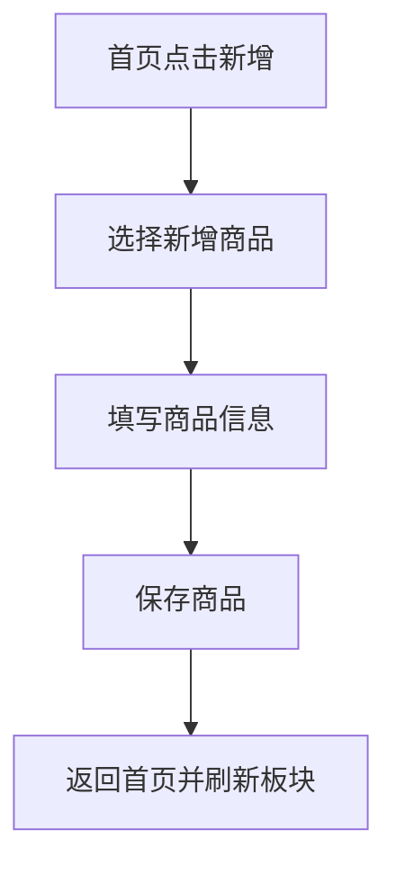
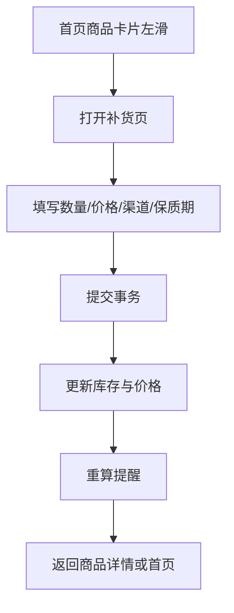
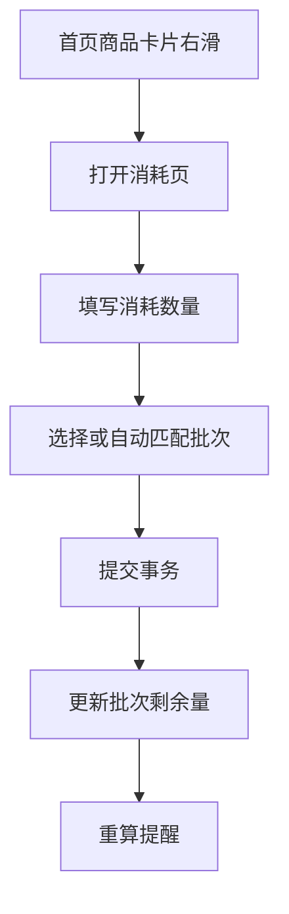
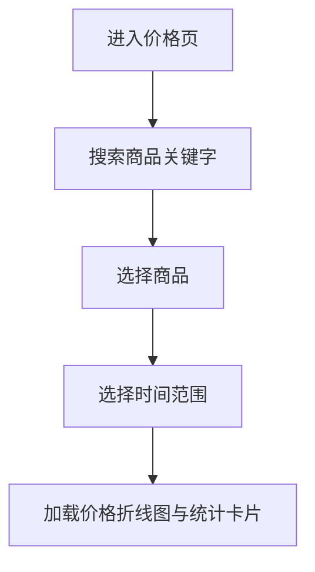
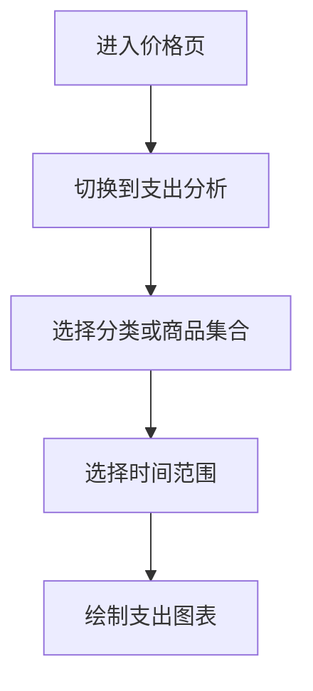
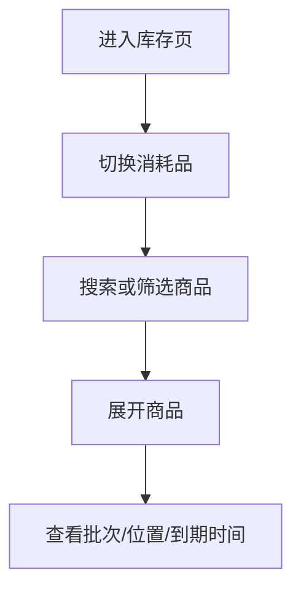
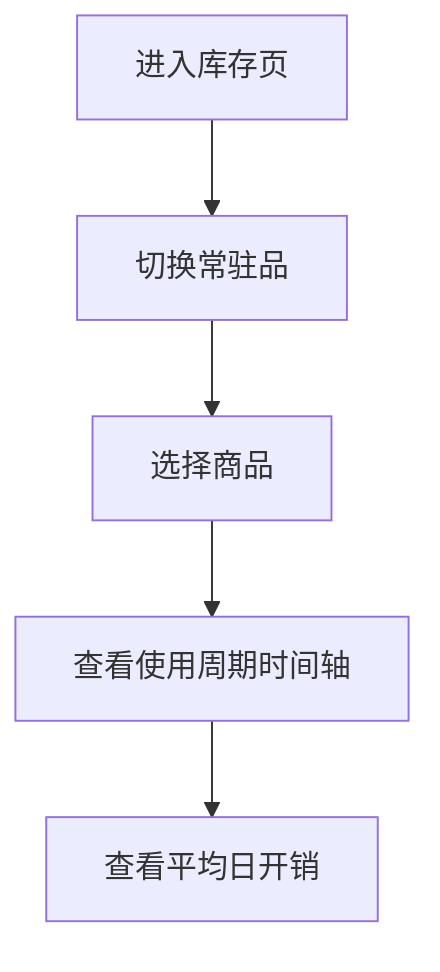

# Lifer Flutter 工程架构与页面原型文档

## 1. 文档目标

本文档定义 Lifer 的 Flutter 工程组织方式、模块划分、页面结构、状态流转和关键交互流程，目标是让项目可以直接进入：

- Flutter 工程初始化
- 路由搭建
- 状态管理落地
- 页面原型设计
- 核心功能开发

## 2. 技术基线

推荐基线：

- Flutter 3.x
- Dart 3.x
- Riverpod
- go_router
- Drift
- flutter_local_notifications
- fl_chart

## 3. 工程目标

V1 工程目标：

- 单代码库覆盖 Android/iOS
- 模块边界清晰
- 页面与业务逻辑分离
- 数据层可测试
- 平台能力集中封装
- 为未来 HarmonyOS 与同步能力预留扩展

## 4. 工程目录方案

推荐采用 `feature-first + layered` 混合结构：

```text
lib/
  app/
    app.dart
    bootstrap/
      app_bootstrap.dart
    router/
      app_router.dart
      route_names.dart
    theme/
      app_theme.dart
      app_colors.dart
      app_spacing.dart
    localization/
      app_localizations.dart
  core/
    constants/
    enums/
    errors/
    utils/
    extensions/
    result/
  domain/
    entities/
    value_objects/
    repositories/
    services/
    usecases/
  data/
    local/
      db/
      daos/
      tables/
      migrations/
    repositories/
    mappers/
    serializers/
  platform/
    notifications/
    file/
    permissions/
    launcher/
  features/
    home/
      presentation/
      application/
      domain/
    catalog/
      presentation/
      application/
    pricing/
      presentation/
      application/
    inventory/
      presentation/
      application/
    notes/
      presentation/
      application/
    settings/
      presentation/
      application/
    analytics/
      presentation/
      application/
    reminder/
      application/
  shared/
    widgets/
    dialogs/
    forms/
    charts/
    layout/
```

## 5. 工程模块职责

## 5.1 app

职责：

- 应用启动
- 主题
- 路由
- 多语言
- 全局错误处理

## 5.2 core

职责：

- 通用常量
- 基础枚举
- 错误对象
- 公共工具函数

## 5.3 domain

职责：

- 核心实体
- 仓储接口
- 规则服务
- 领域用例

说明：

- 不依赖 Flutter UI
- 尽量不依赖平台 API

## 5.4 data

职责：

- Drift 表与 DAO
- Repository 实现
- DTO / Entity 映射
- JSON 导入导出

## 5.5 platform

职责：

- 通知
- 文件读写
- URI 打开
- 系统权限申请

## 5.6 features

职责：

- 按功能聚合页面、状态和用例编排

## 5.7 shared

职责：

- 复用组件
- 通用弹窗
- 通用表单
- 图表与卡片

## 6. 路由设计

## 6.1 顶级结构

V1 推荐采用底部标签页 Shell 路由：

- `/home`
- `/pricing`
- `/inventory`
- `/notes`
- `/settings`

公共详情页：

- `/product/:productId`
- `/category/:categoryId`
- `/channel/:channelId`
- `/note-link/:noteLinkId`

功能页：

- `/product/create`
- `/category/create`
- `/restock/create`
- `/consume/create`
- `/usage-period/create`
- `/import-export`
- `/notification-settings`
- `/obsidian-settings`

## 6.2 路由实现建议

- 使用 `StatefulShellRoute` 维护各标签页独立导航栈
- 详情页从任意标签页可进入
- 新增与编辑流程优先用全屏页，不建议过度依赖底部弹层

## 7. 状态管理方案

## 7.1 推荐方案

使用 Riverpod，按以下类型拆分：

- `Provider`：轻量依赖注入
- `FutureProvider`：一次性异步加载
- `StreamProvider`：监听数据库变化
- `NotifierProvider`：页面复杂交互状态
- `AsyncNotifierProvider`：带副作用的复杂异步流程

## 7.2 状态层次

建议分三层：

- 页面视图状态
- 业务交互状态
- 数据源监听状态

示例：

- 首页卡片数据：`StreamProvider`
- 搜索条件：`NotifierProvider`
- 补货提交流程：`AsyncNotifierProvider`

## 7.3 状态设计原则

- 筛选条件单独维护
- 列表数据尽量由查询 Provider 派生
- 提交动作与展示数据分离
- 避免把数据库实体直接暴露给 UI，优先使用 ViewModel

## 8. UI 组件分层建议

## 8.1 页面层

负责：

- 布局
- 响应导航
- 订阅 ViewModel

## 8.2 Section 组件层

负责：

- 首页板块
- 图表区块
- 搜索与筛选区

## 8.3 Card / Tile 组件层

负责：

- 商品卡片
- 库存批次行
- 渠道价格行

## 8.4 Form 组件层

负责：

- 新增商品
- 新增分类
- 补货
- 消耗
- 提醒规则设置

## 9. 标签页设计

## 9.1 首页

### 页面目标

- 快速总览重点商品
- 展示紧急事项
- 提供高频操作入口

### 页面结构

1. 顶部栏
2. 固定商品板块
3. 提醒商品板块
4. 其他物品板块
5. 悬浮新增按钮

### 顶部栏元素

- 标题
- 搜索入口
- 可选统计摘要

### 固定商品板块

展示：

- 用户指定固定商品
- 一行两列卡片

操作：

- 拖拽排序
- 长按快捷菜单

### 提醒商品板块

展示：

- 根据紧急程度排序
- 高亮显示到期、缺货、低价机会

建议卡片角标：

- `快到期`
- `已过期`
- `库存低`
- `低于目标价`

### 其他物品板块

默认：

- 折叠

分组：

- 消耗品
- 常驻品

组内规则：

- 按分类树展示
- 分类可折叠
- 消耗品按紧急程度排序
- 常驻品按最近时间排序

### 首页交互

- 点击卡片进入商品详情
- 左滑快速补货
- 右滑快速消耗
- 长按进入排序/删除/移动分类

## 9.2 价格页

### 页面目标

- 查看商品历史价格变化
- 对比渠道价格
- 分析支出趋势

### 页面结构

1. 搜索框
2. 筛选栏
3. 商品价格分析区域
4. 支出分析区域

### 筛选栏建议

- 时间范围
- 分类筛选
- 商品选择
- 渠道筛选

### 商品价格分析区域

包含：

- 历史价格折线图
- 历史最高价
- 历史最低价
- 范围内最高价
- 范围内最低价
- 最近价格
- 渠道价格对比列表

### 支出分析区域

支持视角：

- 全部商品
- 分类集合
- 跨分类手选商品集合

图表建议：

- 时间折线图
- 分类柱状图
- 渠道占比图

## 9.3 库存页

### 页面目标

- 管理库存和保质期
- 记录消耗与补货
- 查看消耗趋势和未来可用天数

### 页面结构

1. 搜索框
2. 分段切换
3. 商品列表
4. 分析区域

分段切换：

- 消耗品
- 常驻品

### 消耗品视图

每个商品项展示：

- 当前库存
- 最近到期批次
- 存放位置摘要
- 渠道摘要
- 补货提醒状态

展开后展示：

- 批次列表
- 每个批次的剩余数量、位置、到期时间

### 常驻品视图

每个商品项展示：

- 最近购买价格
- 最近使用周期
- 平均日开销
- 启用时间

展开后展示：

- 历史使用周期时间轴

### 分析区域

指标：

- 消耗曲线
- 平均日消耗
- 预计可用天数

## 9.4 笔记页

### 页面目标

- 管理商品相关笔记和 Obsidian 入口

### 页面结构

1. 搜索框
2. 商品关联笔记列表
3. 外部链接与 Obsidian 区域
4. 模板导出入口

### V1 范围

- 商品与外部链接绑定
- 打开 Obsidian URI
- 查看路径映射

## 9.5 设置页

### 页面结构

1. 数据管理
2. 通知与提醒
3. 语言与货币
4. Obsidian
5. 关于与实验功能

### 数据管理

- JSON 导入
- JSON 导出
- 清理缓存
- 查看导入导出历史

### 通知与提醒

- 全局通知开关
- 提醒时段偏好
- 通知权限状态

### 语言与货币

- 语言
- 货币单位
- 日期格式

### Obsidian

- Vault 路径
- URI Scheme
- 默认模板目录

## 10. 商品详情页设计

商品详情页是多个标签页的汇聚点，建议作为独立核心页面。

## 10.1 消耗品详情

模块：

- 基本信息
- 最新价格
- 价格曲线
- 当前库存
- 批次列表
- 提醒规则
- 消耗记录
- 补货记录
- 笔记链接

快捷操作：

- 补货
- 消耗
- 编辑
- 添加提醒

## 10.2 常驻品详情

模块：

- 基本信息
- 购买价格
- 最近使用周期
- 平均日开销
- 历史使用周期
- 提醒规则
- 笔记链接

## 11. 表单页面设计

V1 建议优先做全屏表单页，减少复杂弹窗。

## 11.1 新增分类页

字段：

- 分类名称
- 父分类
- 图标
- 颜色
- 排序

## 11.2 新增商品页

字段：

- 商品名称
- 别名
- 商品类型
- 所属分类
- Logo
- 单位
- 品牌
- 默认保质期
- 目标价格
- 首页固定
- 备注

根据商品类型动态显示：

- 消耗品：库存相关字段
- 常驻品：使用周期相关入口

## 11.3 补货页

字段：

- 商品
- 数量
- 单位
- 总价
- 购买渠道
- 购买时间
- 保质期
- 存放位置
- 是否新建价格记录
- 备注

提交流程：

- 创建价格记录
- 创建库存批次
- 创建补货记录
- 重算提醒

## 11.4 消耗页

字段：

- 商品
- 数量
- 单位
- 消耗时间
- 消耗批次
- 用途
- 备注

交互建议：

- 默认自动选先进先出批次
- 可手动切换批次

## 11.5 提醒规则页

字段：

- 提醒类型
- 阈值类型
- 阈值
- 提醒时间
- 重复方式
- 优先级

## 12. 首页关键交互流程

## 12.1 新增商品



## 12.2 快速补货



## 12.3 快速消耗



## 13. 价格页交互流程

## 13.1 搜索商品并查看价格曲线



## 13.2 分类支出分析



## 14. 库存页交互流程

## 14.1 查看消耗品库存



## 14.2 查看常驻品使用周期



## 15. Provider 设计建议

以下是建议的 Provider 粒度。

## 15.1 全局 Provider

- `appDatabaseProvider`
- `appRouterProvider`
- `settingsProvider`
- `notificationServiceProvider`

## 15.2 catalog 模块

- `categoryTreeProvider`
- `productSearchProvider`
- `productDetailProvider(productId)`

## 15.3 home 模块

- `homePinnedProductsProvider`
- `homeReminderProductsProvider`
- `homeOtherProductsProvider`
- `homeActionsProvider`

## 15.4 pricing 模块

- `priceFilterProvider`
- `productPriceSeriesProvider(productId, range)`
- `spendingAnalysisProvider(filter)`

## 15.5 inventory 模块

- `inventoryFilterProvider`
- `consumableInventoryProvider(filter)`
- `durableUsageProvider(filter)`
- `inventoryAnalysisProvider(filter)`

## 15.6 reminder 模块

- `activeReminderEventsProvider`
- `reminderRuleListProvider(productId)`
- `recalculateRemindersProvider`

## 15.7 notes 模块

- `productNoteLinksProvider(productId)`
- `obsidianSettingsProvider`

## 16. ViewModel 设计建议

UI 不直接渲染数据库实体，建议抽象如下 ViewModel：

- `HomeProductCardVm`
- `ReminderProductCardVm`
- `ConsumableInventoryItemVm`
- `DurableUsageItemVm`
- `PriceStatsVm`
- `SpendingTrendVm`
- `ProductDetailVm`

这样有几个好处：

- 避免 UI 与数据库字段强耦合
- 便于做字段聚合
- 后续更容易适配 HarmonyOS 或 Web 壳层

## 17. 设计系统建议

虽然当前重点是功能，但建议从一开始统一设计系统。

## 17.1 设计 Token

建议定义：

- 颜色
- 间距
- 圆角
- 阴影
- 字体层级
- 图标尺寸

## 17.2 卡片组件建议

首页商品卡片应具备：

- 小 Logo 区
- 标题
- 两到三行摘要信息
- 状态角标
- 快捷操作入口

## 17.3 图表组件建议

图表外层统一容器：

- 标题
- 时间范围选择
- 指标切换
- 空状态

## 18. 空状态与异常状态

每个页面都需要明确空状态。

示例：

- 首页无商品：引导新增商品
- 价格页无记录：引导录入价格
- 库存页无批次：引导补货
- 笔记页无关联：引导绑定 Obsidian

异常状态建议：

- 导入失败错误页
- 通知权限未开启提示
- 文件访问权限不足提示

## 19. 平台适配建议

## 19.1 Android/iOS

重点处理：

- 通知权限
- 文件选择器权限
- URI 跳转
- 本地数据库生命周期

## 19.2 HarmonyOS 预留

建议从工程上保持以下边界：

- 平台调用全部走 `platform/`
- 业务实体与状态层不依赖具体平台包
- 不将平台能力散落在页面中

## 20. 开发顺序建议

## 20.1 第一阶段

- 建立 Flutter 工程
- 接入 Riverpod、go_router、Drift
- 搭建底部标签页
- 建立主题与设计 Token
- 建立数据库基础表

## 20.2 第二阶段

- 完成分类与商品管理
- 完成首页三板块
- 完成商品详情页

## 20.3 第三阶段

- 完成补货、消耗、常驻品周期
- 完成提醒规则与首页提醒排序

## 20.4 第四阶段

- 完成价格分析与支出图表
- 完成库存分析与消耗图表

## 20.5 第五阶段

- 完成 JSON 导入导出
- 完成设置页
- 完成 Obsidian 外链支持

## 21. MVP 页面清单

V1 最少需要：

- 首页
- 价格页
- 库存页
- 笔记页
- 设置页
- 商品详情页
- 新增/编辑商品页
- 新增/编辑分类页
- 补货页
- 消耗页
- 提醒规则页
- 导入导出页

## 22. 最终建议

这份工程文档里最关键的落地点有三个：

1. 用 `StatefulShellRoute` 搭五个标签页和独立导航栈
2. 用 `ViewModel + Provider` 而不是页面直连数据库实体
3. 所有补货、消耗、提醒重算都走明确的用例层

如果继续推进，下一步最合适的是：

1. 直接初始化 Flutter 工程脚手架
2. 产出 Drift 表定义和 DAO 草稿
3. 补一份页面线框图说明
