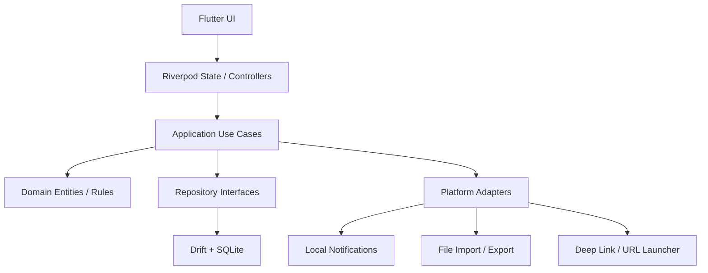

# Lifer 物价与库存监控应用

## 1. 文档目标

本文档用于定义一款面向个人及未来家庭场景的商品价格、库存、消耗与提醒管理应用的完整方案，覆盖：

- 产品定位与边界
- 技术选型与架构设计
- 功能设计与交互规则
- 数据模型与本地存储方案
- 通知、导入导出、同步与扩展能力
- 分阶段实施建议

本文档目标是让项目可以直接进入原型设计、数据库建模、接口定义和工程初始化阶段。

## 2. 产品定位

### 2.1 产品目标

构建一款帮助用户长期管理“买什么、什么时候买、花了多少钱、还剩多少、何时会过期、是否该补货”的跨平台应用。

核心价值：

- 让用户看清商品价格变化与购买渠道差异
- 让用户及时掌握消耗品库存、保质期与补货时机
- 让用户记录常驻品的使用周期和平均日开销
- 让用户建立自己的商品分类体系与消费知识库
- 为未来 AI 菜谱推荐、营养分析、家庭共享和 Obsidian 联动预留能力

### 2.2 目标用户

- 需要管理家庭日用品、食材、保健品、宠物用品的人群
- 对价格波动敏感、希望优化购买时机的人群
- 喜欢做长期记录、习惯精细化生活管理的人群
- 有 Obsidian 使用习惯，希望商品管理与个人知识库结合的人群

### 2.3 产品边界

首期版本聚焦：

- 本地优先的数据管理
- 商品价格、库存、提醒、消耗记录
- 多级分类、自建商品、自建购买渠道
- 本地通知
- JSON 数据导入导出

首期不强依赖：

- 电商自动爬价
- 在线账号体系
- 多人实时协作
- 云端数据库
- AI 推荐服务

这类能力在架构上预留接口，但不作为 V1 必需能力。

## 3. 平台与总体策略

### 3.1 平台范围

当前必须支持：

- Android
- iOS

未来支持：

- HarmonyOS

### 3.2 推荐总体策略

推荐采用：

- 前端：Flutter
- 本地数据库：SQLite
- 状态管理：Riverpod
- 路由：go_router
- 图表：fl_chart
- 本地通知：flutter_local_notifications
- JSON 序列化：json_serializable
- 数据库访问层：Drift

### 3.3 为什么优先选择 Flutter

#### 优势

- Android 与 iOS 单代码库成熟度高
- UI 一致性强，适合复杂卡片、分组、图表和可折叠列表
- 本地数据库、通知、导入导出、深链接、图表生态较成熟
- 开发效率高，适合产品快速迭代
- 后续支持 HarmonyOS 的迁移成本相对可控

#### HarmonyOS 兼容策略

建议分两阶段考虑：

1. 先以 Flutter 完成 Android/iOS 的核心产品能力
2. HarmonyOS 阶段评估以下路线：

- 优先路线：基于 Flutter 社区或厂商兼容方案进行适配
- 备选路线：将核心业务逻辑下沉到纯 Dart Domain 层，必要时重做 HarmonyOS UI 壳层

关键设计原则：

- 业务逻辑、数据模型、规则引擎、提醒计算逻辑全部平台无关
- 平台相关能力只放在 Adapter 层

这样即使未来 HarmonyOS 需要单独 UI 适配，也可以最大化复用核心逻辑。

### 3.4 备选方案对比

#### 方案 A：Flutter

适合度：高

- 优点：跨平台效率高、复杂 UI 表现好、生态成熟、适合本地型应用
- 缺点：HarmonyOS 原生适配需要额外验证

#### 方案 B：React Native

适合度：中

- 优点：前端团队学习门槛低、生态广
- 缺点：复杂列表、图表、本地能力一致性通常不如 Flutter；HarmonyOS 适配路径不够稳

#### 方案 C：Kotlin Multiplatform + 原生 UI

适合度：中

- 优点：共享业务逻辑能力强
- 缺点：UI 需多端分别实现，首期开发成本高；HarmonyOS 复用路径不明显

结论：

- V1 与 V2 推荐 Flutter
- 如果未来家庭共享、复杂联网能力快速膨胀，可在服务端与领域层进一步抽象

## 4. 产品信息架构

应用底部标签页：

- 首页
- 价格
- 库存
- 笔记
- 设置

核心对象：

- 分类 Category
- 商品 Product
- 价格记录 PriceRecord
- 库存批次 StockBatch
- 消耗记录 ConsumptionRecord
- 补货记录 RestockRecord
- 常驻品使用周期 DurableUsagePeriod
- 提醒规则 ReminderRule
- 购买渠道 PurchaseChannel
- 存放位置 StorageLocation
- 笔记关联 NoteLink

## 5. 功能文档

## 5.1 首页

### 5.1.1 页面目标

首页承担“快速总览”和“快速操作”职责，用户应在进入应用后的几秒内看到：

- 哪些商品最重要
- 哪些商品最紧急
- 还有哪些物品处于正常管理状态

### 5.1.2 页面结构

首页分三大板块：

1. 指定固定商品
2. 提醒商品
3. 其他物品

#### 第一板块：指定固定商品

定义：

- 由用户手动指定为首页常驻展示的商品

展示规则：

- 固定显示
- 支持拖拽排序
- 可跨分类选择

适合对象：

- 高频查看商品
- 关键家庭物资
- 价格波动敏感商品

#### 第二板块：提醒商品

定义：

- 当前存在补货、保质期、价格关注或手动标记提醒的商品

排序规则：

- 按紧急程度降序
- 同紧急度按提醒时间升序
- 再按用户手动优先级排序

建议紧急度来源：

- 库存低于提醒阈值
- 保质期即将到期
- 已过期
- 已超出用户期望购买价
- 用户手动置顶提醒

#### 第三板块：其他物品

定义：

- 不在固定商品和提醒商品中的全部商品

展示规则：

- 默认折叠
- 按“消耗品 / 常驻品”分组
- 组内按用户自定义分类显示
- 消耗品默认按紧急程度排序
- 常驻品默认按最近使用时间或最近购买时间排序

### 5.1.3 商品卡片规则

布局：

- 一行两个商品卡片

卡片显示内容：

- 小 Logo
- 商品名称
- 分类路径（可选，折叠显示）

消耗品显示：

- 最近一次购买价格
- 当前库存
- 保质期最近日期

常驻品显示：

- 购买价格
- 日均开销
- 最近购买时间或启用时间

### 5.1.4 首页操作

必须支持：

- 新增分类
- 删除分类
- 排序分类
- 新增商品
- 删除商品
- 排序商品
- 补货商品
- 消耗商品

建议交互：

- 卡片短按进入详情
- 卡片长按进入快捷菜单
- 首页右下角悬浮按钮提供“新增商品 / 新增分类 / 记录补货 / 记录消耗”

### 5.1.5 分类体系要求

- 支持自建分类
- 支持多级嵌套分类
- 支持分类排序
- 支持分类启用/停用
- 删除分类时支持迁移下属商品

### 5.1.6 商品类型

商品需至少分为：

- 消耗品
- 常驻品

定义建议：

- 消耗品：库存会减少、需要补货、可能有保质期
- 常驻品：一般不会按件库存消耗，而是关注使用周期与平均日开销

## 5.2 价格页

### 5.2.1 页面目标

帮助用户判断：

- 某个商品现在买是否划算
- 长期支出趋势如何
- 不同渠道哪个更便宜
- 哪些分类花费过高

### 5.2.2 商品价格分析

需要支持：

- 查询某个商品的历史价格曲线
- 时间维度：全部、指定时间范围
- 历史最高价格
- 历史最低价格
- 范围内最高价格
- 范围内最低价格
- 不同购买渠道的价格对比

图表建议：

- 折线图展示时间序列价格
- 散点或柱状补充展示渠道差异

### 5.2.3 搜索

需要支持：

- 商品关键字匹配搜索

建议支持：

- 商品名称
- 别名
- 分类名联想

### 5.2.4 支出分析

需要支持按以下范围统计支出并绘制曲线：

- 全部商品
- 某几个分类
- 手动选择的几个跨分类商品

时间范围：

- 全部时间
- 用户选择的时间范围

图表建议：

- 支出折线图
- 分类堆叠柱状图
- 渠道占比饼图

### 5.2.5 统计口径建议

支出统计可分两类：

- 实际购买支出：按购买记录统计
- 折算消耗支出：按使用/消耗发生时间统计

V1 建议先实现“实际购买支出”为主，“折算消耗支出”为增强统计。

## 5.3 库存页

### 5.3.1 页面目标

帮助用户持续掌握可消耗商品的真实状态，并沉淀可用于未来 AI 分析的数据。

### 5.3.2 消耗品信息管理

需要支持记录：

- 当前库存
- 库存变更记录
- 补货提醒
- 保质期
- 到期提醒
- 存放位置（1 个或多个）
- 购买渠道
- 线下店铺位置
- 线上店铺链接
- 计量单位
- 备注

### 5.3.3 补货提醒

用户可为不同商品设置：

- 提醒时间
- 剩余库存比例阈值
- 剩余库存数量阈值

规则说明：

- 比例和数量可以同时存在
- 任一命中即可触发提醒
- 应支持重复提醒与静默期

### 5.3.4 保质期提醒

用户可设置 1 个或多个提醒阈值，例如：

- 到期前 30 天
- 到期前 7 天
- 到期前 1 天

规则说明：

- 对同一商品不同批次分别计算
- 最近到期批次应高亮显示

### 5.3.5 常驻品使用记录

需要支持记录：

- 使用开始时间
- 使用结束时间
- 使用期间平均日开销

适用场景：

- 清洁用品设备
- 长期用品
- 电池、滤芯、洗护设备等

### 5.3.6 搜索

需要支持：

- 商品关键字匹配搜索

### 5.3.7 消耗分析

需要支持按以下范围统计消耗并绘制曲线：

- 全部商品
- 某几个分类
- 手动选择的几个跨分类商品

时间范围：

- 全部时间
- 指定时间范围

建议指标：

- 消耗数量
- 消耗频次
- 平均日消耗
- 预计可用天数

### 5.3.8 AI 扩展预留

后续可能接入 AI 模型，基于库存与消费数据实现：

- 剩余食材菜谱推荐
- 营养分析
- 缺失食材建议
- 饮食习惯分析
- 采购建议

因此库存模型从 V1 开始就应保留：

- 营养标签
- 商品成分信息
- 食材类别
- 可食用部位
- 忌口标签

这些字段首期可以隐藏，不要求完整填写，但建议在数据模型中预留。

## 5.4 笔记页

### 5.4.1 页面定位

作为商品和生活记录的延伸模块，首期可弱化为：

- 商品关联备注
- 菜谱记录入口
- 外部笔记链接管理

### 5.4.2 Obsidian 接入方向

已知前提：

- 用户有 Obsidian
- 已自建 Self-hosted LiveSync 同步服务

建议接入策略分阶段：

#### V1

- 仅做外部链接与路径映射
- 商品可关联一个或多个 Obsidian 笔记路径
- 支持从应用中跳转打开对应笔记

#### V2

- 支持将商品、库存或菜谱记录导出为 Markdown
- 支持按模板生成 Obsidian 笔记

#### V3

- 评估直接接入用户指定的同步目录
- 通过安全授权读写指定目录中的 Markdown 文件
- 增加冲突处理和同步状态管理

注意：

- 不建议在 V1 直接强耦合 LiveSync 私有协议
- 更稳定的方式是先围绕本地 Markdown 文件结构建立兼容

## 5.5 设置页

必须支持：

- 用户数据 JSON 导入
- 用户数据 JSON 导出
- 通知设置
- 语言设置
- 记账单位设置
- Obsidian Sync 设置入口

未来扩展：

- 家庭共享
- 联网同步
- P2P 组建家庭
- 数据备份策略
- 隐私与权限管理

## 6. 非功能需求

### 6.1 性能

- 首页首屏渲染时间目标小于 1.5 秒
- 1 万条价格/库存记录下，常用页面保持流畅滚动
- 图表查询在本地数据库中 300ms 至 800ms 内返回

### 6.2 离线可用

- 核心功能必须完全离线可用
- 无网络时不影响商品管理、库存记录、提醒和统计

### 6.3 可维护性

- 模块边界清晰
- 状态管理可测试
- 业务规则可单元测试
- 存储层可替换

### 6.4 安全与隐私

- 默认本地存储
- 用户导出文件可选加密
- 不上传用户数据到远程服务器
- 未来联网功能需单独取得授权

### 6.5 可扩展性

- 数据模型支持增加 AI 字段
- 同步层支持未来接入云端或 P2P
- 平台适配层支持未来接入 HarmonyOS

## 7. 技术架构设计

### 7.1 架构原则

- 本地优先
- 领域驱动的模块划分
- UI 与业务规则分离
- 平台能力抽象
- 先单机、后同步

### 7.2 推荐架构分层

采用 Clean Architecture + Feature-first 目录结构：

- Presentation：页面、组件、状态派生
- Application：用例编排、查询服务、提醒调度
- Domain：实体、值对象、仓储接口、规则引擎
- Data：数据库、DAO、序列化、导入导出、平台实现
- Platform：通知、文件、分享、链接跳转、系统权限

### 7.3 模块划分

建议至少划分以下业务模块：

- catalog：分类与商品目录
- inventory：库存、批次、消耗、补货
- pricing：价格记录、价格分析、渠道
- reminder：补货提醒、到期提醒、首页紧急度计算
- note：备注、Obsidian 映射
- analytics：支出统计、消耗统计、趋势分析
- settings：应用设置、语言、货币、导入导出
- sync_future：未来家庭共享/同步预留模块

### 7.4 客户端架构图



## 8. 技术选型文档

### 8.1 客户端框架

推荐：Flutter 3.x

原因：

- 跨 Android/iOS 成熟
- 强 UI 定制能力
- 图表和本地数据库生态稳定
- 易于做统一视觉设计和复杂卡片布局

### 8.2 编程语言

推荐：Dart

原因：

- 与 Flutter 深度绑定
- 业务逻辑、序列化、测试协同较好
- 纯 Dart 领域层利于未来迁移或复用

### 8.3 状态管理

推荐：Riverpod

原因：

- 比 Provider 更适合复杂状态组合
- 依赖管理清晰
- 测试友好
- 对异步查询、本地数据库监听较友好

### 8.4 路由

推荐：go_router

原因：

- 官方推荐度高
- 适合标签页、详情页、嵌套路由

### 8.5 本地数据库

推荐：SQLite + Drift

原因：

- 本地离线能力稳定
- 结构化查询强
- 聚合统计、时间范围筛选、图表数据查询方便
- 类型安全和迁移支持较好

不推荐首期使用纯 NoSQL 本地库作为主存储，因为：

- 分类嵌套、时间范围统计、价格和库存联合分析更适合关系型查询

### 8.6 JSON 导入导出

推荐：

- `json_serializable` 负责模型序列化
- 导出结构采用版本化 JSON

建议格式：

- 顶层包含 schemaVersion
- 每个模块独立数组
- 保留可扩展 metadata 字段

### 8.7 图表

推荐：fl_chart

原因：

- 折线、柱状、饼图可覆盖首期需求
- 社区使用广

### 8.8 本地通知

推荐：flutter_local_notifications

原因：

- Android/iOS 支持成熟
- 可满足补货提醒、保质期提醒、本地定时通知

补充：

- iOS 需要考虑权限申请与通知摘要行为
- Android 13+ 需要显式通知权限

### 8.9 文件与分享

推荐：

- file_picker
- path_provider
- share_plus
- url_launcher

用途：

- JSON 导入导出
- 外部文件选择
- 打开 Obsidian 链接和线上店铺链接

### 8.10 国际化

推荐：

- Flutter Intl / `intl`

原因：

- 后续支持中文、英文更方便

### 8.11 日志与错误监控

V1 推荐：

- 本地日志模块
- debug 构建可接入 Sentry，release 可配置关闭或用户授权开启

### 8.12 测试体系

推荐：

- 单元测试：领域规则、提醒计算、统计计算
- Widget 测试：关键页面组件
- 集成测试：新增商品、补货、消耗、提醒触发、导入导出

## 9. 数据设计方案

### 9.1 核心实体

#### Category

- id
- parentId
- name
- sortOrder
- isArchived
- createdAt
- updatedAt

#### Product

- id
- categoryId
- name
- alias
- type
- logoUri
- unitId
- isPinnedHome
- isReminderPinned
- notes
- defaultShelfLifeDays
- expectedPrice
- nutritionTags
- metadata
- createdAt
- updatedAt

#### PurchaseChannel

- id
- name
- type（online/offline）
- url
- address
- latitude
- longitude
- notes

#### PriceRecord

- id
- productId
- channelId
- priceAmount
- quantity
- unitAmount
- currencyCode
- purchasedAt
- notes

#### StockBatch

- id
- productId
- sourcePriceRecordId
- totalQuantity
- remainingQuantity
- unitId
- productionDate
- expiryDate
- channelId
- storageNotes
- createdAt

说明：

- 消耗品建议按“批次”建模，而不是只记录总库存
- 这样才能支持不同保质期、不同购买渠道和先进先出分析

#### StorageLocation

- id
- name
- parentId
- notes

#### StockBatchLocation

- batchId
- locationId
- quantity

说明：

- 一个批次可分散存放在多个位置

#### RestockRecord

- id
- productId
- batchId
- quantity
- unitId
- occurredAt
- priceRecordId
- notes

#### ConsumptionRecord

- id
- productId
- batchId
- quantity
- unitId
- occurredAt
- usageType
- notes

#### DurableUsagePeriod

- id
- productId
- startAt
- endAt
- purchasePrice
- averageDailyCost
- notes

#### ReminderRule

- id
- productId
- ruleType
- thresholdType
- thresholdValue
- leadTimeDays
- leadTimeHours
- notifyAtTime
- repeatMode
- isEnabled

#### ProductNoteLink

- id
- productId
- linkType
- title
- uri
- obsidianPath
- createdAt

#### AppSettings

- languageCode
- currencyCode
- notificationEnabled
- obsidianVaultPath
- obsidianUriScheme
- exportEncryptionEnabled

### 9.2 关系设计重点

- 分类支持树形结构：`Category.parentId`
- 商品属于一个主分类，后续可扩展多分类映射表
- 消耗品与价格通过 `PriceRecord` 和 `StockBatch` 关联
- 消耗通过 `ConsumptionRecord` 追踪到批次
- 首页提醒由 `ReminderRule + 实时计算结果` 共同驱动

### 9.3 建议数据库表

- categories
- products
- purchase_channels
- price_records
- stock_batches
- storage_locations
- stock_batch_locations
- restock_records
- consumption_records
- durable_usage_periods
- reminder_rules
- product_note_links
- app_settings
- import_export_history

## 10. 关键业务规则设计

### 10.1 紧急程度计算

提醒商品和首页排序依赖紧急程度分值，建议统一计算模型：

`urgencyScore = shortageScore + expiryScore + manualPriorityScore + priceOpportunityScore`

可参考分值：

- 已过期：100
- 1 天内到期：90
- 7 天内到期：70
- 库存低于绝对阈值：80
- 库存低于比例阈值：60
- 低于目标价格：20
- 手动置顶：30

### 10.2 消耗品库存计算

实时库存 = 所有批次 remainingQuantity 汇总

建议策略：

- 默认先进先出消耗
- 允许用户手动指定消耗批次

### 10.3 常驻品日均开销

计算建议：

`averageDailyCost = purchasePrice / 使用天数`

如果存在多个周期，可统计：

- 最近周期日均开销
- 全部周期平均日均开销

### 10.4 价格统计口径

建议统一支持：

- 原始购买价
- 单位价格

例如：

- 10 元 / 500g
- 自动换算为 0.02 元 / g

这样不同包装规格才可横向比较。

## 11. 页面交互设计建议

### 11.1 首页交互

- 顶部提供全局搜索入口
- 三大板块支持折叠/展开
- 商品卡片支持滑动快捷操作
- 长按进入排序或批量管理模式

### 11.2 价格页交互

- 上方搜索框 + 时间筛选 + 分类筛选
- 中部价格曲线
- 下方展示高低价、均价、渠道分布

### 11.3 库存页交互

- 顶部切换“消耗品 / 常驻品”
- 消耗品使用列表 + 批次展开
- 常驻品使用周期使用时间轴展示

### 11.4 笔记页交互

- 按商品筛选关联笔记
- 支持新增外部链接
- 预留 Markdown 模板入口

### 11.5 设置页交互

- 数据管理单独分组
- 通知与提醒单独分组
- Obsidian 单独分组
- 高风险操作提供二次确认

## 12. JSON 导入导出方案

### 12.1 设计原则

- 可读
- 可迁移
- 可版本升级
- 尽量完整导出

### 12.2 建议结构

```json
{
  "schemaVersion": 1,
  "exportedAt": "2026-04-23T12:00:00Z",
  "appVersion": "0.1.0",
  "settings": {},
  "categories": [],
  "products": [],
  "purchaseChannels": [],
  "priceRecords": [],
  "stockBatches": [],
  "storageLocations": [],
  "restockRecords": [],
  "consumptionRecords": [],
  "durableUsagePeriods": [],
  "reminderRules": [],
  "productNoteLinks": []
}
```

### 12.3 导入规则

- 支持覆盖导入
- 支持合并导入
- 支持导入前校验
- 导入失败时输出错误报告

## 13. 通知与提醒设计

### 13.1 提醒类型

- 补货提醒
- 保质期提醒
- 手动提醒
- 价格关注提醒（V2 可选）

### 13.2 调度策略

建议采用：

- 本地计算 + 本地通知调度

流程：

1. 用户修改库存、批次、提醒规则
2. 应用重新计算未来提醒时间点
3. 重新注册本地通知

### 13.3 首页提醒与系统通知关系

- 首页提醒是“实时计算视图”
- 系统通知是“定时投递动作”

两者都由同一套规则引擎产出，避免逻辑不一致。

## 14. Obsidian 接入设计

### 14.1 推荐最小接入方案

首期支持：

- 商品关联 Obsidian URI
- 商品关联 Vault 相对路径
- 外部打开指定 Markdown 笔记

### 14.2 中期增强

- 生成商品档案 Markdown
- 生成食材库存周报 Markdown
- 生成菜谱模板

### 14.3 风险点

- 移动端直接访问 Vault 文件权限复杂
- 各平台 URI Scheme 行为不同
- LiveSync 服务协议不应在 V1 强绑定

## 15. 家庭共享与联网扩展设计

### 15.1 未来方向

可选两条路线：

#### 路线 A：中心化同步

- 账号体系
- 云端数据库
- 家庭组
- 权限控制

优点：

- 易于跨设备同步
- 容易实现共享和备份

缺点：

- 成本高
- 隐私和运维复杂

#### 路线 B：P2P 家庭共享

- 局域网发现
- 端到端同步
- 手动邀请家庭成员

优点：

- 更隐私
- 服务端成本低

缺点：

- 实现复杂
- 跨网环境体验不稳定

建议：

- V1 不做
- V2 优先“单人多设备备份/恢复”
- V3 再评估家庭共享

## 16. 工程目录建议

```text
lib/
  app/
    router/
    theme/
    bootstrap/
  core/
    error/
    utils/
    constants/
    extensions/
  features/
    home/
    catalog/
    pricing/
    inventory/
    notes/
    settings/
    analytics/
    reminder/
  shared/
    widgets/
    models/
  data/
    local/
      db/
      dao/
      migrations/
    repositories/
    services/
  domain/
    entities/
    value_objects/
    repositories/
    services/
  platform/
    notifications/
    file/
    uri/
    permissions/
```

## 17. 研发阶段建议

### 17.1 V1 MVP

目标：

- 完成单机可用的商品、价格、库存与提醒闭环

范围：

- 分类与商品管理
- 首页三板块
- 消耗品库存与批次
- 常驻品周期记录
- 价格记录与基础曲线
- 搜索
- JSON 导入导出
- 本地通知
- 设置页基础能力

### 17.2 V1.5

- 支出与消耗分析增强
- 渠道对比优化
- Obsidian 外部链接与模板导出
- 首页交互优化

### 17.3 V2

- AI 食材与营养分析
- Markdown/Obsidian 深度联动
- 价格关注提醒
- 更多统计维度

### 17.4 V3

- 家庭共享
- 多端同步
- HarmonyOS 正式适配

## 18. 风险与注意事项

### 18.1 主要风险

- HarmonyOS 适配路径需要尽早验证
- 本地通知在不同系统版本上的行为存在差异
- 库存批次模型若设计过浅，后续 AI 与过期分析会受限
- 如果早期没有统一单位换算，后续价格比较会失真

### 18.2 控制建议

- 在原型阶段就确定“消耗品 vs 常驻品”的字段差异
- 在数据库层从一开始支持批次和单位换算
- 在领域层独立封装提醒引擎和统计引擎
- 首个迭代就输出 JSON schemaVersion 机制

## 19. 最终推荐结论

### 19.1 技术选型结论

推荐采用：

- Flutter + Dart
- Riverpod
- SQLite + Drift
- fl_chart
- flutter_local_notifications
- json_serializable
- go_router

### 19.2 设计结论

优先做一款“本地优先、规则明确、数据扎实”的个人商品管理工具，而不是一开始就做重联网平台。

### 19.3 落地顺序结论

先做：

- 商品与分类
- 库存与价格记录
- 首页提醒
- 统计图表
- JSON 导入导出

再做：

- Obsidian 联动
- AI 分析
- 家庭共享
- HarmonyOS 深化适配

## 20. 当前开发进度

截至 2026-04-28，当前 Flutter 工程已经从原型页继续推进到“本地真实数据驱动”的阶段，下面记录已完成与未完成项，避免设计文档和实现状态脱节。

### 20.1 已完成的主流程能力

- 首页三块内容已接真实数据库数据：
  - 固定商品
  - 提醒商品
  - 其他商品分组
- 首页顶部 Logo 标语组件已移除，首页直接进入业务内容。
- 首页提醒卡片已支持直接处理提醒事件：
  - 标记已处理
  - 延后提醒
  - 延后时长支持 1 小时、3 小时、今天晚些、明天
- 价格页已接真实价格记录与真实图表数据，不再依赖演示数据。
- 价格记录页已支持真实新增与编辑：
  - 渠道选择
  - 单位选择
  - 数量
  - 日期
  - 删除价格记录
- 库存页已接真实商品筛选、搜索和分段切换，不再展示假卡片。
- 商品创建页已接真实分类与单位选择。
- 商品编辑页已完成：
  - 商品详情页进入编辑
  - 表单回填真实商品数据
  - 保存更新数据库
- 商品新增/编辑保存流程已补强：
  - 必填校验（名称 / 分类 / 单位）
  - 防重复提交（保存中禁用按钮）
  - 成功与失败提示
  - 同分类同名商品拦截
- 商品创建后已支持下一步联动引导：
  - 去补货
  - 去计价
  - 去设置提醒
  - 或直接查看详情
- 商品详情页已支持快捷业务入口：
  - 编辑商品
  - 补货
  - 消耗
  - 记价
  - 新建提醒规则
- 补货页和消耗页已支持从商品详情带入当前商品 `productId`。
- 消耗页已支持从库存批次列表带入批次标签作为上下文。
- 库存批次已支持独立编辑：
  - 总数量
  - 剩余数量
  - 单位
  - 购买时间
  - 到期时间
  - 批次名称
  - 存放备注
  - 来源价格记录关联切换（并同步来源价格记录的数量 / 单位 / 购买时间）
  - 批次归档
- 消耗记录已支持独立编辑：
  - 商品
  - 数量
  - 单位
  - 时间
  - 用途
  - 批次
  - 切换真实批次并重算库存回补 / 扣减
  - 新增消耗时按批次自动分摊扣减（可指定批次优先，剩余按 FIFO）
  - 备注
  - 删除记录并回补批次剩余数量
- 提醒规则已支持：
  - 新建
  - 编辑
  - 启用 / 停用
  - 从商品详情直接进入对应规则
- 商品详情页已支持展示：
  - 真实价格记录
  - 真实库存批次
  - 待处理提醒事件
  - 最近消耗记录
  - Obsidian / 笔记关联入口
- 商品详情中的最近价格记录已展示更真实的业务字段：
  - 购买渠道
  - 数量与单位
  - 价格
- 设置页已支持真实 JSON 导入 / 导出。
- 设置页数据管理已支持真正的 JSON 导入/导出流程：
  - 用户自选导入文件路径与导出目标路径
  - UTF-8 格式化导出
  - 导入前 schemaVersion 校验
  - 导入前自动生成备份导出文件
  - 导入失败时返回明确错误信息
- 设置页已支持语言与货币的可视化选择并持久化保存。
- 语言设置已接入应用运行时 locale（zh-CN / en-US）切换生效。
- Android 图标切换已增加强制双阶段 alias 刷新策略，提升桌面图标更新成功率。
- 设置页已展示应用文档目录及约定文件名：
  - `lifer_import.json`
  - `lifer_export_latest.json`
- 设置页的应用 Logo 切换已接入 Android 原生 launcher icon 切换。
- 渠道管理已支持编辑已有渠道。
- 首页、价格、库存、笔记四个主页面均已接入下拉刷新逻辑，可主动触发数据重新拉取与聚合刷新。
- 首页新增菜单已扩展为：新增、补货、消耗、计价、提醒；其中“计价”会引导创建计价品。
- 商品类型已支持“计价品（pricing_only）”，可在价格页搜索，并在首页“其他商品”分组中独立展示。
- 商品详情“价格与库存”已按商品类型区分展示（消耗品/常驻品/计价品）。
- 商品新建/编辑页备注输入框已统一为单行高度。
- 单位下拉展示已统一优化：当单位符号与名称相同（如“台”）时仅显示一次，避免“台 · 台”重复展示。
- 计价记录页已补保存前校验：未关联商品且未填写计价商品名称时阻止提交并提示。
- 价格曲线已改为按周期采样展示，常驻品在“全部”范围下按对应日期计算日均开销，不再统一按今天口径展示。
- 价格曲线触点预览已补日期与金额展示（日期 + 币种金额）。
- 商品已支持独立货币字段：
  - 新建商品默认继承设置页货币
  - 支持在商品编辑页单独修改货币
  - 首页、价格页、库存页、商品详情页的主要价格展示已按商品货币显示币种标识。
- 商品详情页已改为实时流刷新，补货/消耗/计价后可自动更新最近价格、库存批次与摘要信息。
- 常驻品日均开销曲线口径已调整为“同一日期下所有有效周期的日均开销求和”，支持新旧款并行与结束周期后冻结。
- 常驻品在商品详情页中隐藏“待处理提醒事件/提醒规则”区块，仅保留与使用周期相关内容。
- 新建计价品时若填写价格，会自动写入首条计价记录。
- 新建商品后跳转详情页改为 push 栈行为，返回不再直接退出应用。

### 20.2 当前实现方式说明

- 数据存储以 Drift + SQLite 为主。
- 表单下拉已尽量改为读取真实数据，而非硬编码默认值。
- 主页面刷新采用“实时流 + 显式下拉刷新”双轨方式，兼顾自动更新与用户手动刷新。
- Android 启动阶段已设置 edge-to-edge 与透明系统栏样式，减少底部导航区域灰条干扰。
- 导入 / 导出当前采用应用文档目录内的固定文件约定。
- 提醒事件的“延后提醒”当前为本地数据库动作：
  - 将 `dueAt` 顺延指定小时数
  - 同时适当下调紧急度

### 20.3 仍待继续补完的能力

- 库存批次已支持编辑、归档和来源价格记录联动，但存放位置拆分等更完整的批次管理能力仍待补齐。
- 消耗记录已支持编辑、删除和切换真实批次重算库存，但多批次自动分配策略仍可继续增强。
- 价格记录在商品详情中已可新增 / 编辑，但仍可继续增强更多字段展示与统计口径。
- 提醒规则与提醒事件尚未接入系统级本地通知重调度。
- 首页固定商品与分类排序尚未完成拖拽排序管理。
- 分类管理、单位管理、商品管理的独立维护页仍不完整。
- 商品保存前后的一体化联动已补上基础闭环，后续可继续增强策略化推荐。
- JSON 导入目前以约定文件名为主，尚未产品化为更完整的文件浏览 / 选择体验。
- iOS / macOS 侧应用图标真切换尚未补齐，目前已完成 Android 真实 launcher icon 切换。

### 20.4 下一阶段建议

建议下一轮优先继续以下方向：

- 完成库存批次编辑与消耗记录编辑
- 继续增强库存批次与消耗记录的关联编辑能力
- 完成本地通知调度与提醒规则联动
- 完成分类 / 单位 / 商品的独立维护页
- 继续补齐详情页与列表页的上下文快捷录入
- 继续把“默认展示数据”残留入口替换为真实数据库流

---

如果继续推进，下一步建议直接产出以下 3 份文档：

1. V1 数据库表结构 SQL/Drift 设计稿
2. 页面原型与交互流程文档
3. Flutter 工程初始化与模块脚手架方案
